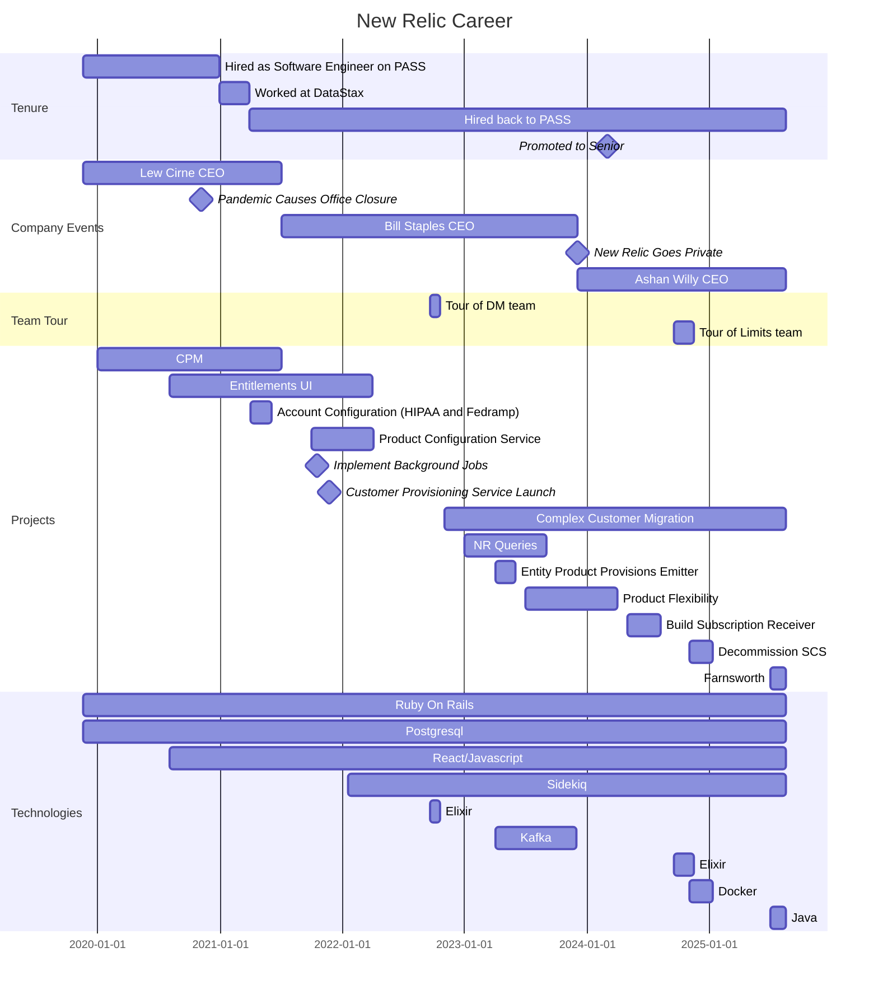

```mermaid
gantt
    title New Relic Career
    dateFormat YYYY-MM-DD
    section Tenure
        Hired as Software Engineer on PASS          :a1, 2019-11-19, 407d
        Worked at DataStax    :a2, after a1, 90d
        Hired back to PASS    :after a2, 1600d
        Promoted to Senior    :milestone, 2022-09-15
    section Company Events
        Lew Cirne CEO :2019-11-19, 2021-07-01
        Pandemic Causes Office Closure :milestone, 2020-03-08
        Bill Staples CEO :2021-07-01, 2023-12-04
        New Relic Goes Private :milestone, :2023-11-08
        Ashan Willy CEO :2023-12-04, 2025-08-15
    section Team Tour
        Tour of DM team :2022-09-19, 30d
        Tour of Limits team    :2024-09-15, 60d
    section Projects
        CPM :2020-01-01, 2021-07-01
        Entitlements UI :2020-08-01, 2022-03-31
        Account Configuration (HIPAA and Fedramp) :2021-04-01, 2021-06-01
        Product Configuration Service :2021-10-01, 2022-04-04
        Implement Background Jobs :milestone, 2021-05-01
        Customer Provisioning Service Launch :milestone, 2022-06-15
        Complex Customer Migration :2022-11-01, 2025-08-15
        NR Queries :2023-01-01, 2023-09-01
        Entity Product Provisions Emitter :2023-04-01, 2023-06-01
        Product Flexibility :2023-07-01, 2024-03-31
        Build Subscription Receiver :2024-05-01, 2024-08-08
        Decommission SCS :2024-11-01, 2025-01-10
        Farnsworth :2025-07-01, 2025-08-15
    section Technologies
        Ruby On Rails :2019-11-18, 2025-08-15
        Postgresql :2019-11-18, 2025-08-15 
        React/Javascript :2020-08-01, 2025-08-15
        Sidekiq :2022-01-18, 2025-08-15
        Elixir :2022-09-19, 30d
        Kafka :2023-04-01, 2023-12-01
        Elixir :2024-09-15, 60d
        Docker :2024-11-01, 2025-01-10
        Java :2025-07-01, 2025-08-15 

```
